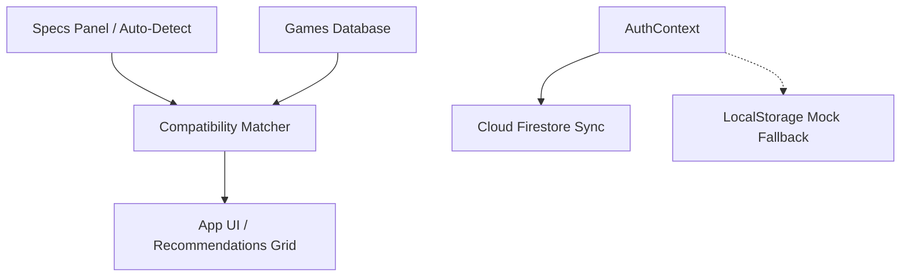

# RIGMatch — Steam Game Specs Recommender

RIGMatch is a high-performance, visually stunning React web application built with Vite and custom Vanilla CSS. It detects or accepts user PC specifications (CPU, GPU, RAM, Storage) and recommends matches from a curated database of popular Steam games, predicting target framerates, settings presets, and evaluating potential system bottlenecks.

---

## 🚀 Key Features

*   **🎮 Interactive Specs Rig customizer**: Search, select, and filter your graphics card and processor from an autocomplete database of hundreds of hardware models.
*   **⚡ WebGL Auto-Detection**: Uses HTML5 WebGL renderer queries (`WEBGL_debug_renderer_info`) and hardware concurrency thread properties to parse and prefill your rig specs.
*   **🔥 Multi-Tier Matching Engine**: Compares your components against game profiles using 6 hardware tiers. Estimates FPS targets, resolutions (1080p, 1440p, 4K), and graphics presets (Ultra, Medium, Low).
*   **🛡️ Optimization Diagnostics & Bottleneck Alerts**: Alerts users if they lack sufficient RAM, if their CPU will bottleneck their GPU, or if they are installing heavy SSD-required games on a slow HDD.
*   **☁️ Firebase Cloud Sync**: Features login and signup tabs. Saves user profiles and hardware setups to Cloud Firestore so specs load automatically across devices. Falls back to local caching (`localStorage`) if keys are absent.
*   **✨ Premium Glassmorphic Design System**: Dark gamer theme with glowing borders, radial spotlight backdrops, and Orbitron typography.

---

## 🛠️ Tech Stack & Architecture

*   **Frontend**: React (Vite HMR)
*   **Styling**: Vanilla CSS (custom variables, responsive grids, keyframes)
*   **Icons**: Lucide React
*   **Database**: Curated offline JSON schema of ~80 major Steam titles
*   **Backend**: Firebase Authentication & Firestore (with dynamic mock fallback)



---

## 📁 Directory Structure

```text
├── src/
│   ├── assets/          # Static assets
│   ├── components/      # UI components (SpecsInput, GameCard, GameModal, AuthModal)
│   ├── context/         # AuthContext (real & mock Firebase auth services)
│   ├── data/            # Curated games database schema
│   ├── firebase/        # Firebase configurations
│   ├── utils/           # Spec-matching tier dictionary & calculations
│   ├── App.jsx          # Main controller, lists operations, filters & sorting
│   ├── index.css        # Typography, custom variables & styling system
│   └── main.jsx         # React bootstrap
├── .env                 # Environment configurations template
└── index.html           # Main HTML entry & SEO headers
```

---

## ⚙️ How to Setup & Run

### 1. Prerequisites
Ensure you have [Node.js](https://nodejs.org/) installed.

### 2. Installation
```powershell
npm install
```

### 3. Run Development Server
```powershell
npm run dev
```

### 4. Build for Production
```powershell
npm run build
```

### 5. Link Live Firebase Instance
Open the `.env` file in the root directory and input your Firebase configuration details:
```env
VITE_FIREBASE_API_KEY=your_api_key
VITE_FIREBASE_AUTH_DOMAIN=your_auth_domain
VITE_FIREBASE_PROJECT_ID=your_project_id
...
```
Once added, the system will switch from **Demo Mode** to **Production Cloud Sync** automatically.
